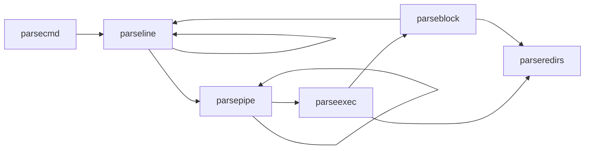

# Xv6文档及源码阅读
## Sh.c源码解析
Shell中循环式地读取用户输入的命令，并将其解析为命令和参数。通过`fork`创建子进程执行命令，使用exec系统调用加载可执行文件。Shell还处理管道、重定向等功能。

### 主函数
Shell的主程序会打开一个buf文件作为命令行的输入缓冲区。它会循环读取用户输入的命令，解析后执行。
- Shell会首先打开三个标准文件描述符：标准输入（0）、标准输出（1）和标准错误（2），并将它们连接到控制台；因为fork会复制父进程的文件描述符列表，所以假如不进行输入输出重定向或管道操作，Shell的子进程会默认继承这些文件描述符。
- 对于`cd`命令，Shell会调用`chdir`函数改变当前工作目录。
- 对于其他命令，Shell会创建一个子进程解析并执行对应的命令。

### 数据结构
指令会被解析为以下几种储存指令的数据结构，并通过结构体内部的指针方便运行指令的函数对指令进行运行：
1. `cmd`：基本命令结构，包含命令类型，形式上是所有指令数据结构的基类。
2. `execcmd`：执行命令结构，包含命令参数。
3. `redircmd`：重定向命令结构，包含重定向文件和模式，以及重定向对应的子指令。
4. `pipecmd`：管道命令结构，包含左右两个命令。
5. `listcmd`：命令列表结构，包含左右两个命令。
6. `backcmd`：后台命令结构，包含一个命令。

#### 指令解析
Shell中将用户输入的一行指令顺序解析为一个树状结构，每个节点代表一个命令。通过递归解析指令，构建出完整的命令树结构。同时，Shell中提供了多种解析函数，用于处理不同类型的命令和参数。这些函数包括：
1. `parsecmd`：解析命令的入口函数，将输入字符串解析为命令结构，同时检查语法错误。
    - 调用`parseline`递归地解析buf中的命令。
    - 检查是否有多余的字符，如果有则报错。
    - 调用`nulterminate`为所有字符串添加尾零('\0')。
2. `parseline`：解析一行命令，处理管道、后台、列表命令。
    - 解析管道命令，调用`parsepipe`。
    - 如果遇到后台符'&'，解析后台命令，调用`backcmd`。
    - 如果遇到列表符';'，递归的解析命令列表，调用`listcmd`链接当前命令和后续命令，后续命令调用`parseline`递归的解析。
3. `parsepipe`：解析管道命令，递归调用`parseexec`。
    - 先调用`parseexec`解析左侧命令。
    - 如果遇到管道符'|'，则调用`pipecmd`将当前命令和后续命令连接起来，后续命令使用`parsepipe`递归解析。
4. `parseredirs`：解析重定向命令，处理输入输出重定向。
    - 解析输入重定向符'<', 输出重定向符'>', 和追加输出重定向符'+'。
    - 调用`redircmd`创建重定向命令结构，并将其与当前命令连接(`redircmd`是父命令)。
5. `parseblock`：解析括号内的命令块。
    - 如果遇到左括号'('，则递归解析括号内的命令，直到遇到右括号')'。
    - 调用`parseline`解析括号内的命令，并处理右括号后的重定向命令。
    - 如果没有遇到右括号')'，则报错。
6. `parseexec`：解析执行命令，处理命令参数和重定向
    - 如果遇到左括号'('，则调用`parseblock`解析括号内的命令。
    - 调用`execcmd`创建执行命令结构。
    - 循环读取命令参数，并将参数存储在`argv`数组中，同时调用`parseredirs`处理重定向命令
    - 当遇到管道符'|', 右括号')', 分号';', 或后台符'&'，停止读取参数。

调用树：


### 指令运行
Shell中通过runcmd函数执行解析后的命令。该函数根据命令类型调用不同的处理逻辑：
1. 对于执行命令（`EXEC`），调用`exec`函数执行对应的程序。
2. 于重定向命令（`REDIR`），先关闭对应位置的文件描述符，然后打开重定向文件，递归执行子命令。每个进程都有一个单独的文件列表，文件列表包含`fd`（文件描述符）及其对应的文件指针。`fd`对应'0'代表标准输入，'1'代表标准输出，'2'代表标准输入错误。而重定向通过改变这两个文件描述符对应的文件来实现输入输出重定向（在`parseredirs`中）。
3. 对于管道命令（`PIPE`），创建管道并创建两个子进程并分别执行左右两个命令。因为左侧程序只将标准输出写入管道，右侧程序只从管道读取标准输入。而`fork`只会原样拷贝父进程的文件描述符列表，所以原先的管道文件的文件描述符的对应是错误的，应将其重定向到'0'或'1'上。所以先关闭对应的标准输入/输出文件（`close(0/1)`），然后调用`dup`为管道文件分配新的文件描述符。而在`kernel/file.c`的`filealloc`函数中，文件描述符是顺序分配的，所以分配到的描述符即为刚刚关闭的文件描述符，这样就成功的将管道前后两个进程连接了起来。而在连接完成后，原先错误的文件描述符会被关闭（`close(p[0]/p[1])`），这样就不会影响后续的文件操作。
4. 对于命令列表（`LIST`），先执行左侧命令，等待其结束后再执行右侧命令。
5. 对于后台命令（`BACK`），在子进程中执行命令，不等待其结束。

## syscall调用方法
根据手册，Xv6提供了以下系统调用接口，用户程序可以通过这些接口与内核进行交互。每个系统调用都有对应的函数原型和功能描述。
| System call | Description |
| --- | --- |
| int fork() | Create a process, return child’s PID. |
| int exit(int status) | Terminate the current process; status reported to wait(). No return. |
| int wait(int *status) | Wait for a child to exit; exit status in *status; returns child PID. |
| int kill(int pid) | Terminate process PID. Returns 0, or -1 for error. |
| int getpid() | Return the current process’s PID. |
| int sleep(int n) | Pause for n clock ticks. |
| int exec(char *file, char *argv[]) | Load a file and execute it with arguments; only returns if error. |
| char *sbrk(int n) | Grow process’s memory by n zero bytes. Returns start of new memory. |
| int open(char *file, int flags) | Open a file; flags indicate read/write; returns an fd (file descriptor). |
| int write(int fd, char *buf, int n) | Write n bytes from buf to file descriptor fd; returns n. |
| int read(int fd, char *buf, int n) | Read n bytes into buf; returns number read; or 0 if end of file. |
| int close(int fd) | Release open file fd. |
| int dup(int fd) | Return a new file descriptor referring to the same file as fd. |
| int pipe(int p[]) | Create a pipe, put read/write file descriptors in p[0] and p[1]. |
| int chdir(char *dir) | Change the current directory. |
| int mkdir(char *dir) | Create a new directory. |
| int mknod(char *file, int, int) | Create a device file. |
| int fstat(int fd, struct stat *st) | Place info about an open file into *st. |
| int link(char *file1, char *file2) | Create another name (file2) for the file file1. |
| int unlink(char *file) | Remove a file. |


# Lab1 实验报告
## Boot Xv6
### 环境配置
使用WSL2 以及 Unbuntu 24.04 LTS 进行实验。
使用以下指令安装Xv6所需的工具和依赖。
```cmd
$ sudo apt-get update && sudo apt-get upgrade
$ sudo apt-get install git build-essential gdb-multiarch qemu-system-misc gcc-riscv64-linux-gnu binutils-riscv64-linux-gnu
```

正确安装时输入响应指令会输出以下内容：
```cmd
$ qemu-system-riscv64 --version
QEMU emulator version 7.2.0
```

使用以下指令检查RISC-V编译器是否安装成功。以下三条指令至少有一条成功输出：
```cmd      
$ riscv64-linux-gnu-gcc --version
riscv64-linux-gnu-gcc (Debian 10.3.0-8) 10.3.0
$ riscv64-unknown-elf-gcc --version
riscv64-unknown-elf-gcc (GCC) 10.1.0
$ riscv64-unknown-linux-gnu-gcc --version
riscv64-unknown-linux-gnu-gcc (GCC) 10.1.0
```

### 实验代码克隆与运行
使用以下指令克隆Xv6实验代码仓库。
```cmd
$ git clone git://g.csail.mit.edu/xv6-labs-2024
$ cd xv6-labs-2024
```

使用以下指令编译Xv6代码。
```
$ make qemu
```

按下Ctrl-p可以打印当前进程列表。
按下Ctrl-a x可以停止QEMU模拟器。

### 调试方法
可以采用以下方法调试Xv6操作系统：

1. 使用 script 记录输出  
    如果你的打印语句输出较多，可以在 `make qemu` 前运行 `script`，这样所有控制台输出都会被记录到一个文件，便于后续搜索和分析。完成后记得输入 `exit` 退出 `script`。

2. 使用 GDB 调试
    除了打印调试，有时需要单步执行汇编代码或查看栈上的变量。可以通过以下步骤使用 GDB 调试 xv6：
    - 使用tmux等终端复用工具将终端分割，在一个终端窗口运行 `make qemu-gdb`。
    - 在另一个窗口运行 `gdb-multiarch`（或 `riscv64-linux-gnu-gdb`），并输入 `target remote localhost:26000` 连接到 QEMU。
    - 在 GDB 中设置断点（如 `b panic`），然后输入 `c`（continue）让 xv6 运行到断点处。
    - 当内核崩溃或挂起时，可以在 GDB 中按 `Ctrl-C`，然后输入 `bt` 查看函数调用栈。

    如果启动 GDB 时出现 `warning: File ".../.gdbinit" auto-loading has been declined`，可按提示在 `~/.gdbinit` 添加 `add-auto-load-safe-path` 解决。

3. 查看汇编代码
    编译 xv6 时，Makefile 会生成 `kernel/kernel.asm`，可用于查看内核的汇编代码。所有用户程序也会生成对应的 `.asm` 文件。

4. 定位崩溃位置
    如果内核因非法内存访问等原因崩溃，会输出包含程序计数器（`sepc`）的错误信息。可以在 `kernel.asm` 中搜索该地址，或用 `addr2line -e kernel/kernel pc-value` 查找对应的函数。

5. QEMU Monitor
    QEMU 提供了 monitor 控制台，可通过 `Ctrl-a c` 进入。常用命令如 `info mem` 可查看页表信息。若需指定 CPU 核心，可用 `cpu` 命令，或用 `make CPUS=1 qemu` 只启动一个核心。

## sleep


## pinpong

## 