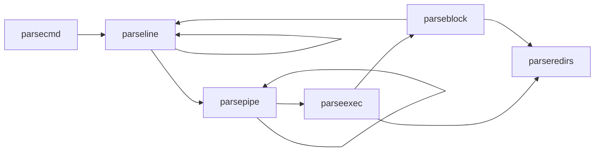
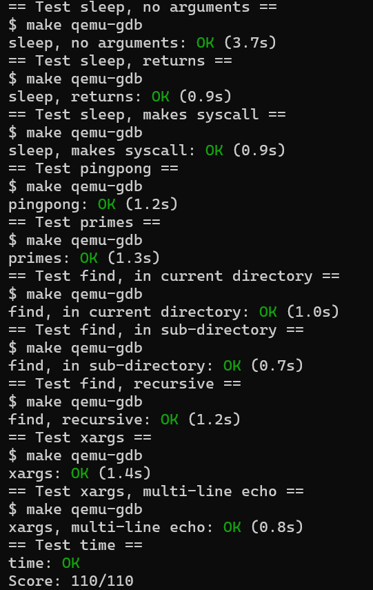

# Lab1 实验报告
## 源码阅读
### Sh.c源码解析
Shell中循环式地读取用户输入的命令，并将其解析为命令和参数。通过`fork`创建子进程执行命令，使用exec系统调用加载可执行文件。Shell还处理管道、重定向等功能。Shell完全是一个用户级程序，所有的系统调用都通过`syscall`接口与内核交互。

### 主函数
Shell的主程序会打开一个buf文件作为命令行的输入缓冲区。它会循环读取用户输入的命令，解析后执行。
- Shell会首先打开三个标准文件描述符：标准输入（0）、标准输出（1）和标准错误（2），并将它们连接到控制台；因为fork会复制父进程的文件描述符列表，所以假如不进行输入输出重定向或管道操作，Shell的子进程会默认继承这些文件描述符。
- 对于`cd`命令，Shell会调用`chdir`函数改变当前工作目录。
- 对于其他命令，Shell会创建一个子进程解析并执行对应的命令。

### 数据结构
指令会被解析为以下几种储存指令的数据结构，并通过结构体内部的指针方便运行指令的函数对指令进行运行：
1. **cmd**：基本命令结构，包含命令类型，形式上是所有指令数据结构的基类。
2. **execcmd**：执行命令结构，包含命令参数。
3. **redircmd**：重定向命令结构，包含重定向文件和模式，以及重定向对应的子指令。
4. **pipecmd**：管道命令结构，包含左右两个命令。
5. **listcmd**：命令列表结构，包含左右两个命令。
6. **backcmd**：后台命令结构，包含一个命令。

#### 指令解析
Shell中将用户输入的一行指令顺序解析为一个树状结构，每个节点代表一个命令。通过递归解析指令，构建出完整的命令树结构。同时，Shell中提供了多种解析函数，用于处理不同类型的命令和参数。这些函数包括：
1. **parsecmd**：解析命令的入口函数，将输入字符串解析为命令结构，同时检查语法错误。
    - 调用`parseline`递归地解析buf中的命令。
    - 检查是否有多余的字符，如果有则报错。
    - 调用`nulterminate`为所有字符串添加尾零('\0')。
2. **parseline**：解析一行命令，处理管道、后台、列表命令。
    - 解析管道命令，调用`parsepipe`。
    - 如果遇到后台符'&'，解析后台命令，调用`backcmd`。
    - 如果遇到列表符';'，递归的解析命令列表，调用`listcmd`链接当前命令和后续命令，后续命令调用`parseline`递归的解析。
3. **parsepipe**：解析管道命令，递归调用`parseexec`。
    - 先调用`parseexec`解析左侧命令。
    - 如果遇到管道符'|'，则调用`pipecmd`将当前命令和后续命令连接起来，后续命令使用`parsepipe`递归解析。
4. **parseredirs**：解析重定向命令，处理输入输出重定向。
    - 解析输入重定向符'<', 输出重定向符'>', 和追加输出重定向符'+'。
    - 调用`redircmd`创建重定向命令结构，并将其与当前命令连接(`redircmd`是父命令)。
5. **parseblock**：解析括号内的命令块。
    - 如果遇到左括号'('，则递归解析括号内的命令，直到遇到右括号')'。
    - 调用`parseline`解析括号内的命令，并处理右括号后的重定向命令。
    - 如果没有遇到右括号')'，则报错。
6. **parseexec**：解析执行命令，处理命令参数和重定向
    - 如果遇到左括号'('，则调用`parseblock`解析括号内的命令。
    - 调用`execcmd`创建执行命令结构。
    - 循环读取命令参数，并将参数存储在`argv`数组中，同时调用`parseredirs`处理重定向命令
    - 当遇到管道符'|', 右括号')', 分号';', 或后台符'&'，停止读取参数。

调用树：


### 指令运行
Shell中通过runcmd函数执行解析后的命令。该函数根据命令类型调用不同的处理逻辑：
1. 对于执行命令（`EXEC`），调用`exec`函数执行对应的程序。
2. 对于重定向命令（`REDIR`），先关闭对应位置的文件描述符，然后打开重定向文件，递归执行子命令。每个进程都有一个单独的文件列表，文件列表包含`fd`（文件描述符）及其对应的文件指针。`fd`对应'0'代表标准输入，'1'代表标准输出，'2'代表标准输入错误。而重定向通过改变这两个文件描述符对应的文件来实现输入输出重定向（在`parseredirs`中）。
3. 对于管道命令（`PIPE`），创建管道并创建两个子进程并分别执行左右两个命令。因为左侧程序只将标准输出写入管道，右侧程序只从管道读取标准输入。而`fork`只会原样拷贝父进程的文件描述符列表，所以原先的管道文件的文件描述符的对应是错误的，应将其重定向到'0'或'1'上。所以先关闭对应的标准输入/输出文件（`close(0/1)`），然后调用`dup`为管道文件分配新的文件描述符。而在`kernel/file.c`的`filealloc`函数中，文件描述符是顺序分配的，所以分配到的描述符即为刚刚关闭的文件描述符，这样就成功的将管道前后两个进程连接了起来。而在连接完成后，原先错误的文件描述符会被关闭（`close(p[0]/p[1])`），这样就不会影响后续的文件操作。
4. 对于命令列表（`LIST`），先执行左侧命令，等待其结束后再执行右侧命令。
5. 对于后台命令（`BACK`），在子进程中执行命令，不等待其结束。

## Xv6文档阅读 Chapter 1 : Operating System Interfaces
### System Calls
根据手册，Xv6提供了以下系统调用接口，用户程序可以通过这些接口与内核进行交互。每个系统调用都有对应的函数原型和功能描述。
| System call                         | Description                                                              |
| ----------------------------------- | ------------------------------------------------------------------------ |
| int fork()                          | Create a process, return child’s PID.                                    |
| int exit(int status)                | Terminate the current process; status reported to wait(). No return.     |
| int wait(int *status)               | Wait for a child to exit; exit status in *status; returns child PID.     |
| int kill(int pid)                   | Terminate process PID. Returns 0, or -1 for error.                       |
| int getpid()                        | Return the current process’s PID.                                        |
| int sleep(int n)                    | Pause for n clock ticks.                                                 |
| int exec(char *file, char *argv[])  | Load a file and execute it with arguments; only returns if error.        |
| char *sbrk(int n)                   | Grow process’s memory by n zero bytes. Returns start of new memory.      |
| int open(char *file, int flags)     | Open a file; flags indicate read/write; returns an fd (file descriptor). |
| int write(int fd, char *buf, int n) | Write n bytes from buf to file descriptor fd; returns n.                 |
| int read(int fd, char *buf, int n)  | Read n bytes into buf; returns number read; or 0 if end of file.         |
| int close(int fd)                   | Release open file fd.                                                    |
| int dup(int fd)                     | Return a new file descriptor referring to the same file as fd.           |
| int pipe(int p[])                   | Create a pipe, put read/write file descriptors in p[0] and p[1].         |
| int chdir(char *dir)                | Change the current directory.                                            |
| int mkdir(char *dir)                | Create a new directory.                                                  |
| int mknod(char *file, int, int)     | Create a device file.                                                    |
| int fstat(int fd, struct stat *st)  | Place info about an open file into *st.                                  |
| int link(char *file1, char *file2)  | Create another name (file2) for the file file1.                          |
| int unlink(char *file)              | Remove a file.                                                           |

### I/O and File descriptors
1. **File Descriptors**: 每个进程都有一个文件描述符表，文件描述符是一个整数，用于标识打开的文件。标准输入、输出和错误分别对应0、1和2。
2. **read/write**: 通过`read`和`write`系统调用，用户程序可以从文件描述符中读取数据或向其写入数据。每个文件描述符都有一个偏移量，表示下一个读写操作的位置。`read`和`write`返回读取/写入的字节数。
3. **open/close**: 使用`open`系统调用打开文件，返回一个文件描述符。使用`close`系统调用关闭文件描述符，释放资源。`open`可以指定文件的访问模式（只读、只写、读写、无文件创建、截断），其分配的文件描述符永远是进程未使用的文件描述符中最小的（顺序分配）。
4. **dup**: 使用`dup`系统调用可以复制一个文件描述符，返回一个新的文件描述符，指向相同的文件。这样可以实现文件描述符的共享。比如可以实现类似于`2>&1`的重定向，将标准错误输出重定向到标准输出。
5. **redirect**: 使用`dup`和`close`、`open`等函数可以实现文件描述符的重定向。比如先关闭标准输出文件（`close(1)`），紧接着再打开重定向文件（`open(FILE)`），就可以使重定向文件分配到标准输出上。而为了方便Shell在重定向程序的输入输出，我们需要将`fork`和`exec`分开的，在这两个函数执行的期间，Shell可以对输入输出进行重定向。否则在`exec`函数执行后，Shell无法再对输入输出进行重定向，需要程序自行完成。

### Pipes
Pipes是进程间通信的机制，允许一个进程的输出直接作为另一个进程的输入。Xv6中通过`pipe`系统调用创建管道，返回两个文件描述符：一个用于读（`p[0]`），一个用于写（`p[1]`）。管道是单向的，数据从写端流向读端。

### FileSystem
1. **chdir**: 改变当前工作目录。
2. **mkdir/mknod**: 创建目录或设备文件。
3. **inode**: 文件系统中的每个文件或目录都有一个唯一的inode，包含文件的元数据，即类型（文件/目录/设备）、长度、位置，link数量。这些数据被储存在一个名为`struct stat`的结构体中。
4. **link/unlink**: `link`创建一个新的目录项指向现有的inode，同时增加link数量；`unlink`删除目录项，减少link数量，当link数量为0且无`fd`指向inode时，释放inode和数据块。因而我们可以通过先创建文件然后直接unlink来创建一个只在进程生存期间存在的无名临时文件。
5. **cdir**: 改变当前工作目录，更新进程的工作目录。Unix系统提供用户级文件操作程序与shell，与内核级shell相比，这极大地拓展了命令行的可拓展性。但在目录切换却必须在shell中进行执行，因为shell的工作目录无法通过子进程切换。

## Boot Xv6
### 环境配置
使用WSL2 以及 Unbuntu 24.04 LTS 进行实验。
使用以下指令安装Xv6所需的工具和依赖。
```bash
$ sudo apt-get update && sudo apt-get upgrade
$ sudo apt-get install git build-essential gdb-multiarch qemu-system-misc gcc-riscv64-linux-gnu binutils-riscv64-linux-gnu
```

正确安装时输入响应指令会输出以下内容：
```bash
$ qemu-system-riscv64 --version
QEMU emulator version 7.2.0
```

使用以下指令检查RISC-V编译器是否安装成功。以下三条指令至少有一条成功输出：
```bash     
$ riscv64-linux-gnu-gcc --version
riscv64-linux-gnu-gcc (Debian 10.3.0-8) 10.3.0
$ riscv64-unknown-elf-gcc --version
riscv64-unknown-elf-gcc (GCC) 10.1.0
$ riscv64-unknown-linux-gnu-gcc --version
riscv64-unknown-linux-gnu-gcc (GCC) 10.1.0
```

### 实验代码克隆与运行
使用以下指令克隆Xv6实验代码仓库。
```bash
$ git clone git://g.csail.mit.edu/xv6-labs-2024
$ cd xv6-labs-2024
```

使用以下指令编译Xv6代码。
```bash
$ make qemu
```

按下Ctrl-p可以打印当前进程列表。
按下Ctrl-a x可以停止QEMU模拟器。

### 调试方法
可以采用以下方法调试Xv6操作系统：

1. 使用 script 记录输出  
    如果你的打印语句输出较多，可以在 `make qemu` 前运行 `script`，这样所有控制台输出都会被记录到一个文件，便于后续搜索和分析。完成后记得输入 `exit` 退出 `script`。

2. 使用 GDB 调试
    除了打印调试，有时需要单步执行汇编代码或查看栈上的变量。可以通过以下步骤使用 GDB 调试 xv6：
    - 使用tmux等终端复用工具将终端分割，在一个终端窗口运行 `make qemu-gdb`。
    - 在另一个窗口运行 `gdb-multiarch`（或 `riscv64-linux-gnu-gdb`），并输入 `target remote localhost:26000` 连接到 QEMU。
    - 在 GDB 中设置断点（如 `b panic`），然后输入 `c`（continue）让 xv6 运行到断点处。
    - 当内核崩溃或挂起时，可以在 GDB 中按 `Ctrl-C`，然后输入 `bt` 查看函数调用栈。

    如果启动 GDB 时出现 `warning: File ".../.gdbinit" auto-loading has been declined`，可按提示在 `~/.gdbinit` 添加 `add-auto-load-safe-path` 解决。

3. 查看汇编代码
    编译 xv6 时，Makefile 会生成 `kernel/kernel.asm`，可用于查看内核的汇编代码。所有用户程序也会生成对应的 `.asm` 文件。

4. 定位崩溃位置
    如果内核因非法内存访问等原因崩溃，会输出包含程序计数器（`sepc`）的错误信息。可以在 `kernel.asm` 中搜索该地址，或用 `addr2line -e kernel/kernel pc-value` 查找对应的函数。

5. QEMU Monitor
    QEMU 提供了 monitor 控制台，可通过 `Ctrl-a c` 进入。常用命令如 `info mem` 可查看页表信息。若需指定 CPU 核心，可用 `cpu` 命令，或用 `make CPUS=1 qemu` 只启动一个核心。

### 成绩
使用以下指令来自动获取实验成绩：
```bash
make grade
```

实验通过时，成绩会显示为：
```bash
== Test sleep, no arguments ==
$ make qemu-gdb
sleep, no arguments: OK (3.7s)
```

## sleep
### 实验目的
实现一个用户级的sleep程序，类似于UNIX的sleep命令。该sleep程序应暂停指定数量的时钟滴答(ticks)。时钟滴答是由xv6内核定义的时间概念，即定时器芯片产生两个中断之间的时间间隔。

### 实验步骤
1. 在`user/`目录下创建`sleep.c`文件。
2. 在`Makefile`中添加`sleep`程序的编译规则。
3. 在`sleep.c`中实现sleep函数，使用`user.h`中的`sleep`系统调用。
4. 编译并运行`sleep`程序，验证其功能是否正常。

### 实验结果
运行`sleep`程序时，输入参数为暂停的时钟滴答数。例如，输入`sleep 100`将使程序暂停100个时钟滴答。可以通过在终端中运行`sleep`命令来验证其功能。

```sh
$ sleep 100
```

### 实验结论
本实验通过一个简单的用户级程序实现了对xv6内核的`sleep`系统调用的使用。通过该实验，我理解了如何在用户空间编写程序并与内核进行交互，同时掌握了如何使用系统调用来实现进程的暂停功能。

## pinpong

### 实验目的
实现一个用户级的pingpong程序，使用xv6系统调用在两个进程之间通过管道进行双向通信。父进程应向子进程发送一个字节；子进程应打印“<pid>: received ping”，其中<pid>是其进程ID，将字节写入管道返回给父进程，并退出；父进程应从子进程读取字节，打印“<pid>: received pong”，并退出。

### 实验步骤
1. 在`user/`目录下创建`pingpong.c`文件。
2. 在`Makefile`中添加`pingpong`程序的编译规则。
3. 在`pingpong.c`中实现pingpong程序，使用`pipe`系统调用创建管道，并使用`fork`创建子进程。
4. 父进程向子进程发送一个字节，子进程读取该字节并打印消息，然后将字节写回父进程。
5. 父进程从子进程读取字节并打印消息，然后退出。

> 注意：必须在读取到对方发来的字节后打印消息，且子进程必须在发送新字节前打印消息，否则可能会出现死锁或输出顺序错误。

### 实验结果
运行`pingpong`程序时，父进程和子进程之间通过管道进行通信。父进程向子进程发送一个字节，子进程打印消息并将字节写回父进程，父进程再读取字节并打印消息。

```sh
$ pingpong
4: received ping
5: received pong
```
### 实验结论
本实验通过实现一个简单的用户级pingpong程序，掌握了如何在xv6中使用管道进行进程间通信。通过该实验，我理解了如何创建管道、使用`fork`创建子进程，以及如何在父子进程之间传递数据。同时，我也体会到了在多进程环境中进行同步和通信的重要性。

## primes
### 实验目的
参照"Bell Labs and CSP Threads"中的质数计算方式实现一个用户级的primes程序，使用xv6系统调用在多个进程之间通过管道进行素数筛选。该程序应创建多个子进程，每个子进程负责筛选一个素数，并将结果传递给下一个子进程。

### 实验步骤
1. 在`user/`目录下创建`primes.c`文件。
2. 在`Makefile`中添加`primes`程序的编译规则。
3. 在`primes.c`中实现primes程序，使用`pipe`系统调用创建管道，并使用`fork`创建子进程。
4. 主进程创建一个管道和一个子进程，子进程负责筛选素数并将结果传递给下一个子进程。主进程则生成奇数并将其写入管道。
5. 子进程从管道中读取素数，筛选出下一个素数，并将其写入管道。

> 当主进程传递完所有奇数后，子进程应接收到一个特殊的结束标志（如-1），以便正确退出。

### 程序资源管理
在xv6中，资源的最大数量定义在`kernal/param.h`中。对于本实验，主要涉及以下资源：
1. 进程数量限制：
    - **文件（管道）**：Xv6中系统的最大打开文件数量由`NFILE`定义，默认为100。对于本题，n个进程需要n-1个管道。
    - **进程**：Xv6中系统的最大进程数量由`NPROC`定义，默认为64。而系统中`sh`和`ls`默认运行。
   
    因此，在本实验中，最多可以创建62个进程，即打印62个质数（即293），每个子进程使用一个管道与父进程通信。

2. 进程内部资源限制：
    - **文件描述符**：每个进程的文件描述符数量由`NOFILE`定义，默认为16。每个管道仅需要两个文件描述符（读和写）。而在`fork`时，子进程会继承父进程的文件描述符，因此在创建新进程时需要及时关闭不需要的文件描述符。
   
    因此，每当子进程创建时，就立即关闭其继承的父进程的管道读写文件描述符。而只有当需要创建新进程时，才会创建新的管道并打开新的文件描述符。并在将读文件描述符传递给子进程后，关闭父进程的读文件描述符。

### 实验结果
运行`primes`程序时，主进程生成奇数并将其写入管道，子进程从管道中读取素数并筛选出下一个素数。最终输出所有筛选出的素数。

```sh
$ primes
prime 2
prime 3

···

prime 277
```

### 实验结论
本实验通过实现一个用户级的`primes`程序，掌握了如何在xv6中使用管道进行进程间通信和素数筛选。通过该实验，我更深入地理解了如何创建管道、使用`fork`创建子进程，以及如何在多个子进程之间传递数据，以及如何对文件描述符等系统资源进行管理。

## find
### 实验目的
写一个简单版本的UNIX find程序，用于在xv6中查找目录树中具有特定名称的所有文件。

### 实验步骤
1. 在`user/`目录下创建`find.c`文件。
2. 在`Makefile`中添加`find`程序的编译规则。
3. 参照``user/ls.c``的实现，通过文件的`fstat`系统调用获取文件信息，并根据文件类型进行处理。
4. 对于目录类型的文件，递归地查找其目录中的所有子文件（排除"."和".."）。
5. 每打开一个新文件就比较其名称是否与目标名称相同，如果相同则打印该文件的路径。

### 实验结果
运行`find`程序时，输入参数为要查找的文件名。例如，输入
```sh
$ mkdir test
$ mkdir test/test
$ find . test
./test
./test/test
```
将查找当前目录及其子目录中所有名为`test`的文件，并打印其路径。

### 实验结论
本实验通过实现一个简单的`find`程序，掌握了如何在xv6中遍历目录树并查找特定文件。通过该实验，我理解了如何使用系统调用获取文件信息、处理目录和文件类型，以及如何递归地遍历目录结构。同时，我也体会到了在多级目录结构中查找文件的复杂性和挑战。

## xargs
### 实验目的
写一个简单版本的UNIX xargs程序，其命令行参数描述要运行的命令，它从标准输入读取行，并将每行作为参数附加到命令中运行。UNIX xargs会向命令传递多个参数，而本实验中我们只需要每次传递一个参数。相当于UNIX xargs的`-n 1`选项。
### 实验步骤
1. 在`user/`目录下创建`xargs.c`文件。
2. 在`Makefile`中添加`xargs`程序的编译规则。
3. 逐行读取标准输入的内容，并将每行作为参数传递给指定的命令并执行。

> 对于exec命令，其调用的对应的系统调用会自行解析命令行参数数量，并以零作为参数列表的结束标志。因此在传递参数时需要确保最后一个参数是一个空指针。

### 实验结果
运行`xargs`程序时，输入参数为要执行的命令和参数。例如，输入
```sh
$ (echo 1; echo 2) | xargs echo
1
2
```
将从标准输入读取两行内容，并分别将其作为参数传递给`echo`命令，输出结果为两行。

### 实验结论
本实验通过实现一个简单的`xargs`程序，掌握了如何在xv6中读取标准输入并将其作为参数传递给命令执行。通过该实验，我理解了如何处理标准输入、解析命令行参数，以及如何使用`exec`函数执行命令。同时，我也体会到了在处理命令行参数时需要注意的细节，如参数列表的结束标志等。

## Grade 截图
