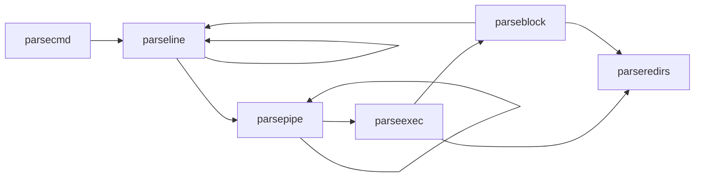

# Xv6文档阅读 
## Chapter 1 : Operating System Interfaces
### System Calls
根据手册，Xv6提供了以下系统调用接口，用户程序可以通过这些接口与内核进行交互。每个系统调用都有对应的函数原型和功能描述。
| System call                         | Description                                                              |
| ----------------------------------- | ------------------------------------------------------------------------ |
| int fork()                          | Create a process, return child’s PID.                                    |
| int exit(int status)                | Terminate the current process; status reported to wait(). No return.     |
| int wait(int *status)               | Wait for a child to exit; exit status in *status; returns child PID.     |
| int kill(int pid)                   | Terminate process PID. Returns 0, or -1 for error.                       |
| int getpid()                        | Return the current process’s PID.                                        |
| int sleep(int n)                    | Pause for n clock ticks.                                                 |
| int exec(char *file, char *argv[])  | Load a file and execute it with arguments; only returns if error.        |
| char *sbrk(int n)                   | Grow process’s memory by n zero bytes. Returns start of new memory.      |
| int open(char *file, int flags)     | Open a file; flags indicate read/write; returns an fd (file descriptor). |
| int write(int fd, char *buf, int n) | Write n bytes from buf to file descriptor fd; returns n.                 |
| int read(int fd, char *buf, int n)  | Read n bytes into buf; returns number read; or 0 if end of file.         |
| int close(int fd)                   | Release open file fd.                                                    |
| int dup(int fd)                     | Return a new file descriptor referring to the same file as fd.           |
| int pipe(int p[])                   | Create a pipe, put read/write file descriptors in p[0] and p[1].         |
| int chdir(char *dir)                | Change the current directory.                                            |
| int mkdir(char *dir)                | Create a new directory.                                                  |
| int mknod(char *file, int, int)     | Create a device file.                                                    |
| int fstat(int fd, struct stat *st)  | Place info about an open file into *st.                                  |
| int link(char *file1, char *file2)  | Create another name (file2) for the file file1.                          |
| int unlink(char *file)              | Remove a file.                                                           |

### I/O and File descriptors
1. **File Descriptors**: 每个进程都有一个文件描述符表，文件描述符是一个整数，用于标识打开的文件。标准输入、输出和错误分别对应0、1和2。
2. **read/write**: 通过`read`和`write`系统调用，用户程序可以从文件描述符中读取数据或向其写入数据。每个文件描述符都有一个偏移量，表示下一个读写操作的位置。`read`和`write`返回读取/写入的字节数。
3. **open/close**: 使用`open`系统调用打开文件，返回一个文件描述符。使用`close`系统调用关闭文件描述符，释放资源。`open`可以指定文件的访问模式（只读、只写、读写、无文件创建、截断），其分配的文件描述符永远是进程未使用的文件描述符中最小的（顺序分配）。
4. **dup**: 使用`dup`系统调用可以复制一个文件描述符，返回一个新的文件描述符，指向相同的文件。这样可以实现文件描述符的共享。比如可以实现类似于`2>&1`的重定向，将标准错误输出重定向到标准输出。
5. **redirect**: 使用`dup`和`close`、`open`等函数可以实现文件描述符的重定向。比如先关闭标准输出文件（`close(1)`），紧接着再打开重定向文件（`open(FILE)`），就可以使重定向文件分配到标准输出上。而为了方便Shell在重定向程序的输入输出，我们需要将`fork`和`exec`分开的，在这两个函数执行的期间，Shell可以对输入输出进行重定向。否则在`exec`函数执行后，Shell无法再对输入输出进行重定向，需要程序自行完成。

### Pipes
Pipes是进程间通信的机制，允许一个进程的输出直接作为另一个进程的输入。Xv6中通过`pipe`系统调用创建管道，返回两个文件描述符：一个用于读（`p[0]`），一个用于写（`p[1]`）。管道是单向的，数据从写端流向读端。

### FileSystem
1. **chdir**: 改变当前工作目录。
2. **mkdir/mknod**: 创建目录或设备文件。
3. **inode**: 文件系统中的每个文件或目录都有一个唯一的inode，包含文件的元数据，即类型（文件/目录/设备）、长度、位置，link数量。这些数据被储存在一个名为`struct stat`的结构体中。
4. **link/unlink**: `link`创建一个新的目录项指向现有的inode，同时增加link数量；`unlink`删除目录项，减少link数量，当link数量为0且无`fd`指向inode时，释放inode和数据块。因而我们可以通过先创建文件然后直接unlink来创建一个只在进程生存期间存在的无名临时文件。
5. **cdir**: 改变当前工作目录，更新进程的工作目录。Unix系统提供用户级文件操作程序与shell，与内核级shell相比，这极大地拓展了命令行的可拓展性。但在目录切换却必须在shell中进行执行，因为shell的工作目录无法通过子进程切换。

### Code: Shell
Shell中循环式地读取用户输入的命令，并将其解析为命令和参数。通过`fork`创建子进程执行命令，使用`exec`系统调用加载可执行文件。Shell还处理管道、重定向等功能。Shell完全是一个用户级程序，所有的系统调用都通过`syscall`接口与内核交互。

#### 主函数
Shell的主程序会打开一个buf文件作为命令行的输入缓冲区。它会循环读取用户输入的命令，解析后执行。
- Shell会首先打开三个标准文件描述符：标准输入（0）、标准输出（1）和标准错误（2），并将它们连接到控制台；因为fork会复制父进程的文件描述符列表，所以假如不进行输入输出重定向或管道操作，Shell的子进程会默认继承这些文件描述符。
- 对于`cd`命令，Shell会调用`chdir`函数改变当前工作目录。
- 对于其他命令，Shell会创建一个子进程解析并执行对应的命令。

#### 数据结构
指令会被解析为以下几种储存指令的数据结构，并通过结构体内部的指针方便运行指令的函数对指令进行运行：
1. **cmd**：基本命令结构，包含命令类型，形式上是所有指令数据结构的基类。
2. **execcmd**：执行命令结构，包含命令参数。
3. **redircmd**：重定向命令结构，包含重定向文件和模式，以及重定向对应的子指令。
4. **pipecmd**：管道命令结构，包含左右两个命令。
5. **listcmd**：命令列表结构，包含左右两个命令。
6. **backcmd**：后台命令结构，包含一个命令。

#### 指令解析
Shell中将用户输入的一行指令顺序解析为一个树状结构，每个节点代表一个命令。通过递归解析指令，构建出完整的命令树结构。同时，Shell中提供了多种解析函数，用于处理不同类型的命令和参数。这些函数包括：
1. **parsecmd**：解析命令的入口函数，将输入字符串解析为命令结构，同时检查语法错误。
    - 调用`parseline`递归地解析buf中的命令。
    - 检查是否有多余的字符，如果有则报错。
    - 调用`nulterminate`为所有字符串添加尾零('\0')。
2. **parseline**：解析一行命令，处理管道、后台、列表命令。
    - 解析管道命令，调用`parsepipe`。
    - 如果遇到后台符'&'，解析后台命令，调用`backcmd`。
    - 如果遇到列表符';'，递归的解析命令列表，调用`listcmd`链接当前命令和后续命令，后续命令调用`parseline`递归的解析。
3. **parsepipe**：解析管道命令，递归调用`parseexec`。
    - 先调用`parseexec`解析左侧命令。
    - 如果遇到管道符'|'，则调用`pipecmd`将当前命令和后续命令连接起来，后续命令使用`parsepipe`递归解析。
4. **parseredirs**：解析重定向命令，处理输入输出重定向。
    - 解析输入重定向符'<', 输出重定向符'>', 和追加输出重定向符'+'。
    - 调用`redircmd`创建重定向命令结构，并将其与当前命令连接(`redircmd`是父命令)。
5. **parseblock**：解析括号内的命令块。
    - 如果遇到左括号'('，则递归解析括号内的命令，直到遇到右括号')'。
    - 调用`parseline`解析括号内的命令，并处理右括号后的重定向命令。
    - 如果没有遇到右括号')'，则报错。
6. **parseexec**：解析执行命令，处理命令参数和重定向
    - 如果遇到左括号'('，则调用`parseblock`解析括号内的命令。
    - 调用`execcmd`创建执行命令结构。
    - 循环读取命令参数，并将参数存储在`argv`数组中，同时调用`parseredirs`处理重定向命令
    - 当遇到管道符'|', 右括号')', 分号';', 或后台符'&'，停止读取参数。

调用树：


#### 指令运行
Shell中通过runcmd函数执行解析后的命令。该函数根据命令类型调用不同的处理逻辑：
1. 对于执行命令（`EXEC`），调用`exec`函数执行对应的程序。
2. 对于重定向命令（`REDIR`），先关闭对应位置的文件描述符，然后打开重定向文件，递归执行子命令。每个进程都有一个单独的文件列表，文件列表包含`fd`（文件描述符）及其对应的文件指针。`fd`对应'0'代表标准输入，'1'代表标准输出，'2'代表标准输入错误。而重定向通过改变这两个文件描述符对应的文件来实现输入输出重定向（在`parseredirs`中）。
3. 对于管道命令（`PIPE`），创建管道并创建两个子进程并分别执行左右两个命令。因为左侧程序只将标准输出写入管道，右侧程序只从管道读取标准输入。而`fork`只会原样拷贝父进程的文件描述符列表，所以原先的管道文件的文件描述符的对应是错误的，应将其重定向到'0'或'1'上。所以先关闭对应的标准输入/输出文件（`close(0/1)`），然后调用`dup`为管道文件分配新的文件描述符。而在`kernel/file.c`的`filealloc`函数中，文件描述符是顺序分配的，所以分配到的描述符即为刚刚关闭的文件描述符，这样就成功的将管道前后两个进程连接了起来。而在连接完成后，原先错误的文件描述符会被关闭（`close(p[0]/p[1])`），这样就不会影响后续的文件操作。
4. 对于命令列表（`LIST`），先执行左侧命令，等待其结束后再执行右侧命令。
5. 对于后台命令（`BACK`），在子进程中执行命令，不等待其结束。


## Chapter 2: Operating System Organization
一个操作系统必须能够为运行在其平台上的程序满足三个要求：并发、隔离和交流。

### Abstracting physical resources
在Chapter1中所展示的系统调用可以被视为一种运行库(libaray)，尽管用户程序也可以自行实现一些运行库（在一些嵌入式设备上常见），并直接于硬件资源交互，但操作系统提供的系统调用封装了对硬件的访问，提供了更高层次的抽象，使得用户程序可以更方便地进行开发和移植，比如：对于文件系统，操作系统只提供open/read/write/close等系统调用，而不需要用户程序关心具体的硬件细节，而操作系统也能更好的安排硬件资源。这在CPU、内存、文件描述符等方面也是同理。

### User mode, supervisor mode, and system calls
为了保证隔离性，即当一个程序发生错误，不会导致其他程序也一并崩溃，操作系统必须限制应用程序对操作系统数据结构和其他应用内存的修改甚至访问。而CPU提供了针对强隔离的硬件支持，RISC-V CPU有三种运行模式：用户模式（User mode）、监督模式（Supervisor mode）和机器模式（Machine mode）。

1. CPU以机器模式开始执行，主要用于在电脑开启的过程中设置。Xv6执行一些代码后转为监督模式。
2. 监督模式下，CPU允许执行特权级指令，如：开关中断、独写页表地址寄存器。假如一个处于用户模式的程序尝试执行特权指令，CPU会中断该程序执行并转到监督模式并终止该程序。只允许执行用户模式指令的程序被称为运行在用户空间(user space)，可以执行特权级指令的程序被称为运行在内核空间(kernel space)，而运行在内核空间的程序又被称为内核（kernel）。
3. 当用户程序需要调用内核的一些功能时，一个程序不能直接调用这些功能，而是通过一条特殊指令(RISC-V中的`ecall`指令)将CPU的模式从用户模式转为监督模式，然后再由内核应判断相应的参数是否合理，并决定是否执行相应操作，完成后再返回用户模式。

### Kernel organization
单一内核(monolithic kernel, 又称宏内核)架构是将整个操作系统作为一个整体的、有着完全的硬件特权的程序。这种设计的好处是设计者不需要考虑哪些部件是运行在内核空间中的，而且也方便操作系统的各部分合作运行。而缺点就是内核的复杂性和维护难度较大，任何一个部分的错误都可能导致整个系统的崩溃。

微内核(microkernel)架构则是将操作系统的核心功能（如进程管理、内存管理、设备驱动等）最小化，其他功能（如文件系统、Shell等）则作为用户空间的服务运行，而各个服务间的交互则通过向内核发起通信实现。这样可以提高系统的稳定性和安全性，因为用户空间的服务崩溃不会影响到内核的运行。同时，微内核也更容易进行扩展和维护，但由于用户空间和内核空间之间的通信开销较大，性能可能会受到影响。


Xv6采用的是单一内核架构，所有的操作系统功能都运行在内核空间中。

### Process overview
进程(Process)是Xv6的隔离单元。进程这一抽象阻止其访问其他进程的内存、CPU和文件描述符等资源，也防止其篡改内核。

为了施行隔离，进程这一抽象提供了一种“幻觉”，使其认为自己拥有一台私有机器，每个进程提供给程序独立的、其他程序无法独写的私有内存，或者叫地址空间(address space)。进程也提供独立的CPU来执行程序指令。

**内存隔离**

Xv6使用页表来提供给进程独立的地址空间。每个进程都有一个页表，页表将虚拟地址映射到物理地址。

Xv6中，地址空间起始于零虚拟地址。首先是指令、然后是全局变量、然后是栈、然后是堆。Xv6只使用64位地址的低38位，所以最大地址为`0x3fffffffff`。在地址空间的最上层，还有一个跳板页(trampoline)和一个陷阱帧页(trapframe)。这两个页的作用是让程序在用户态和内核态之间的切换，跳板页中储存了进入和离开内核的代码；而陷阱帧页则用于保存程序的用户寄存器。


**CPU隔离**

每个进程都有一个存储着用于执行进程的状态。为了在进程间切换CPU，内核会暂停当前执行的线程并储存其状态，并恢复其他线程的状态。一些状态则储存在线程的栈上：每个进程有两个栈，一个用户栈，一个内核栈。当进程执行用户指令时，只使用用户栈，而内核栈闲置；当进程切换到内核执行时，则使用内核栈，而用户栈仍保存已储存的数据，只是不再活跃。

一个进程可以通过`ecall`指令提升硬件权限级别并改变程序计数器到内核指定的进入点，进入点处的代码会切换到内核栈上并进入内核空间。当系统调用完成时，内核切换回用户栈，并通过`sret`指令切换回用户空间。

### Code: starting xv6, the first process and system call
当RISC-V计算机启动，它初始化其自身并运行一个储存在只读内存中的引导程序(bootloader)。引导程序将xv6内核加载至内存，然后在机器模式下，CPU执行`_entry`处的代码。

**entry**

以下是`_entry`处的代码：
```asm
# set up a stack for C.
# stack0 is declared in start.c,
# with a 4096-byte stack per CPU.
# sp = stack0 + (hartid * 4096)
la sp, stack0 # 将stack0的地址(start中定义，表示所有处理器的栈的起始地址)加载到sp寄存器(地址寄存器)
li a0, 1024*4 # 每个CPU的栈大小为4096字节
csrr a1, mhartid # 获取当前处理器的ID
addi a1, a1, 1 # 处理器加一，因为栈是自顶向下延伸的
mul a0, a0, a1 
add sp, sp, a0
# jump to start() in start.c
call start
```

这段代码将每个CPU的栈指针(sp)设置为其在物理内存中的栈的起始位置。每个CPU都有一个独立的栈。

**start**

在`start`函数中，设置一些只允许在机器模式下执行的特权级指令，并切换到监督模式。为了切换到监督模式，需要使用到指令`mret`，这个指令是用来从一个从监督模式到机器模式的调用中返回的，为了正确返回到监督模式，需要在`start`中进行一系列操作，使得`start`看起来是被监督模式所调用的一样：
1. 将`mstatus`寄存器(储存上一个权限模式)设置为监督模式
2. 将`mepc`寄存器(储存返回地址)设置为`main`函数的地址
3. 将`satp`寄存器设置为0来在监督模式中禁用虚拟地址
4. 配置地址保护来让监督模式能够访问所有物理内存
5. 将所有的中断和异常委托给监督模式。

在进入监督模式前，`start`还需初始化计时器来产生时钟中断。在调用`mret`返回以后，CPU将进入监督模式并开始执行`main`函数。

**main**

`main`函数是Xv6的入口点，负责初始化系统并创建第一个用户进程。在`main`函数中，首先会初始化控制台、页表系统、文件系统等重要组件，然后分配一个新进程，加载`initcode.S`代码到内存并配置好其各项参数使其处于就绪态。

在执行完上述内容后，还会运行`scheduler`函数来调度，`scheduler`中通过直接切换CPU上下文来实现进程间的切换。而当进程因为I/O操作或定时中断而阻塞时，CPU会切换回`scheduler`对应的上下文来选择下一个运行的进程。

**initCode**

`initcode`汇编程序是一个运行在用户空间的程序，他会将`SYS_exec`系统调用号放入`a7`寄存器中，并将`init`和`argv`的地址分别放入`a0`和`a1`寄存器中，然后通过`ecall`指令触发系统调用。

**sys_call**

内核的系统调用的总处理函数中保存着一张系统调用与其自身的处理函数的映射表。每个系统自身的调用处理函数会根据`a7`寄存器中的值找到对应的处理函数并执行。处理函数中会根据需要，从用户寄存器中读取参数，执行完毕后，会将结果写入`a0`寄存器并返回给用户程序。上述“寄存器”均指进程对应的`trapframe`中的表示寄存器的变量。在程序恢复时，内核会将`trapframe`中的寄存器值恢复到CPU寄存器中。

**init**

在第一个进程这里，`init`程序将会被加载并执行。`init`程序会打开`console`文件，并将其作为标准输入输出以及错误输入输出，然后创建子进程并执行`shell`程序。

**总结**

在Xv6中，总共有三种栈：用户栈、内核栈、CPU栈。用户栈用于存储用户程序的局部变量和函数调用信息，内核栈用于存储内核态下的函数调用信息，CPU栈则用于初始化内核与`scheduler`函数的上下文。CPU栈在`_entry`中被初始化，内核栈在`fork`中被初始化，用户栈在`exec`系统调用中被初始化。

在Xv6启动时，先为每个CPU分配独立的栈空间并初始化各个栈的指针，然后降低权限进入`main`函数初始化一系列内核组件、创建第一个用户进程并运行`scheduler`函数，最后`scheduler`函数选中刚刚创建的进程，在进程中通过`exec`系统调用加载并运行`init`程序，`init`程序会打开`console`文件并创建子进程执行`shell`程序。

## Chapter 3: Page tables

在操作系统向每个进程提供私有的地址空间时，页表是最流行的一种机制。页表允许操作系统使用很多“技巧”：将多个相同的内存页映射到同一个物理页上，用一个未映射的页来守护栈空间（防止栈溢出）等。

### Paging hardware

在RISC-V的SV39机制中，地址只使用64-bit虚拟地址的低39位。低39位中，前27位为页表索引(index)，后12位为页内偏移(offset)。逻辑上RISC-V的页表是一个有2^27项PTE(page table entries, 页表项)的数组，每一个PTE包含一个44-bit的PPN(physical page number, 物理页号)和一些标志项。页表硬件使用39位中的高27位来寻找一个PTE，然后使用PTE中的44位PPN和39位的低12位偏移来组合成一个56-bit的物理地址。一个页(page)的大小为4KB(4096 Byte)。


Sv39能表示512GB的虚拟地址空间，通常来说这是充足的，但其仍有增长空间，比如其PPN有44位，能表示16TB的物理内存，其仍可以增长另外的10位。再者，如果需要更多的虚拟地址空间，可以使用更高位的地址，比如Sv48能表示256TB的虚拟地址空间。

Sv39使用三级页表（Sv48使用四级页表）来映射虚拟地址到物理地址。每个页表页(page-table page)有512项，每项8 Byte，所以每个页表页占用4KB的空间（一个页的大小）。根页表页只有一页，其中的项储存的是中间页表页的物理地址，中间页表页则储存的是叶子页的物理地址。Sv39使用39位中的高27位来索引三级页表，每9位索引一层页表。如果页表项不存在，则会触发缺页异常(page-fault exception)。

这种设计节省了大量的内存，因为不需要的第二三级页表页可以不分配物理内存。同时为了避免每次转换都需要查找页表，RISC-V还引入了TLB(Translation Lookaside Buffer)来缓存最近使用的页表项。


每个PTE都包含标志位来指示该页的状态。
1. PTE_V: 有效位(Valid)，表示该页表项是否有效。
2. PTE_R: 读权限位(Readable)，表示该页是否可读。
3. PTE_W: 写权限位(Writable)，表示该页是否可写。
4. PTE_X: 执行权限位(Executable)，表示该页是否可执行。
5. PTE_U: 用户访问位(User-accessible)，表示该页是否可被用户模式访问。
6. PTE_G: 全局位(Global)，表示该页是否为全局页。
7. PTE_A: 访问位(Accessed)，表示该页是否被访问过。
8. PTE_D: 脏位(Dirty)，表示该页是否被修改过，中间页表中为0。
9. PTE_RSW: 保留位(Reserved for Supervisor Software)。

为了让CPU使用页表，内核必须将根页表页的物理地址写入`satp`寄存器中。`satp`中储存的是根页表页的物理页号(PPN)以及一些标志位，因此切换页表时不需要考虑虚拟地址转换的问题。

### Kernel address space

Xv6每个进程使用一张页表来描述进程的用户地址空间，内核则使用一个独立的页表来描述内核地址空间。内核通过配置其地址空间的布局来使其自身能够在可预测的虚拟地址处访问物理内存和其他硬件资源。

QEMU模拟的计算机的物理地址是这样布局的：
1. RAM(物理内存)开始于物理地址`0x80000000`(`KERNBASE`)处并延伸到至少`0x88000000`(`PHYSTOP`)。
2. I/O设备的交互接口会被作为处于物理地址`0x80000000`以下的内存映射控制寄存器暴露给软件，内核可以通过与这些特殊的物理地址交互来控制硬件设备。
3. 还有一些其他的设备，比如`boot ROM`则开始于物理地址`0x1000`。

内核使用“直接映射(direct mapping)”，将RAM和内存映射设备寄存器从物理地址映射到虚拟地址空间中。这样做可以简化内核对内存的读写，因为内核可以直接使用虚拟地址来访问物理内存和设备寄存器，而不需要进行复杂的地址转换。

还有一些内核虚拟地址不是直接映射的：
1. 跳板页：它被映射到虚拟地址空间的顶部，用户页表也有相同的映射。这种设计使得在内核地址空间中，跳板页的代码所在的物理页被映射了两次，第一次是在虚拟地址空间的顶部，一次是物理内存的直接映射。
2. 内核栈：每个进程都有一个内核栈，其会被映射到高地址，这样我们就可以在下方预留一个为映射的页来作为栈的守护页(guard page)，防止栈溢出修改内核代码和数据导致内核错误。因为栈是自顶向下增长的，所以守护页需要放在栈的下方，所以内核栈的映射最好也在虚拟地址的高地址处。

完整的虚拟地址以及物理地址的布局以及映射关系如下图所示：


### Code: creating an address space

Xv6代码中操作地址空间和页表的部分主要位于`vm.c`中，以下是一些重要的函数和数据结构：
1. `pagetabel_t`：一个`uint64`类型的变量，表示根页表的物理地址。
2. `walk`和`mappages`：操纵页表的核心函数，它们分别负责查找页表项和为新映射创建页表项。
3. 从`kvm`起始的函数操作内核页表，从`uvm`起始的函数操作用户页表。
4. `copyout`和`copyin`在用户和内核地址空间之间交换数据，主要用于系统调用的参数。他们需要显示转换地址来查找对应的物理内存。

**kvminit**

Xv6启动时所调用的`main`中会调用`kvminit`，其又会调用`kvmmake`，这一连串的调用发生在页表启用之前，所以会直接操作物理内存。`kvmmake`会调用`kvmmap`函数来建立内核所需的映射关系，包括内核的指令、数据、物理内存以及设备内存。而`kvmmap`通过调用`mappages`来实现具体的映射操作。`kvmmap`函数所进行的操作就是将已经装入内核代码和设备等内容的未分页的物理地址映射到虚拟地址空间中并将其分页。

**mappages**

`mappages`负责为新的映射创建页表项并将其插入到页表中，该函数自身不会分配新的物理内存，其只是在虚拟地址与物理地址间建立映射关系。它根据给定的虚拟地址范围及其对应的物理地址范围来建立映射。对于范围内的虚拟地址，其会以页为单位分别调用`walk`函数查找地址的所在的PTE表项，然后初始化PTE来储存相应的物理地址和标志位。

**walk**

`walk`负责根据虚拟地址查找其所在页的页表项并返回，该函数的操作只针对页目录，只是逐级查询（或创建）页目录，并不关心虚拟地址所在的页是否有效。其本身是在模拟RISC-V硬件的页表查找过程。如果`va`路径上的页表项不存在且`alloc`参数为真，则会分配新的页表项并初始化。

```c
/*
 * @param pagetable 根页表的物理地址
 * @param va 所查询的虚拟地址
 * @param alloc 是否分配新的页表项，为真时会递归分配所有缺失的页表项
 * @return 所查询的虚拟地址所在的页表项指针
 */
pte_t *
walk(pagetable_t pagetable, uint64 va, int alloc)
{
  if(va >= MAXVA)  // MAXVA为最大虚拟地址
    panic("walk");

  for(int level = 2; level > 0; level--) {
    // PX(level, va)计算出虚拟地址中当前层级的页表索引
    // 得到的值即为页表项指针
    pte_t *pte = &pagetable[PX(level, va)];

    // PTE_V是一个页表项的有效位处为1的掩码
    if(*pte & PTE_V) {

      // PTE2PA将页表项转换为物理地址，即通过右移10位去掉标志位并左移12位得到页表的物理地址
      pagetable = (pagetable_t)PTE2PA(*pte);
#ifdef LAB_PGTBL
      if(PTE_LEAF(*pte)) {
        return pte;
      }
#endif
    } else {
      // 如果页表项不存在且需要分配新页表，则分配新的页表项并初始化
      if(!alloc || (pagetable = (pde_t*)kalloc()) == 0)
        return 0;
      memset(pagetable, 0, PGSIZE); 
      // 将新分配的页表的物理地址写入页表项，并标记为有效
      *pte = PA2PTE(pagetable) | PTE_V;  
    }
  }
  return &pagetable[PX(0, va)];
}
```

**TLB**

因为TLB中缓存的页表项是虚拟地址到物理地址的映射关系，不同的虚拟地址空间的映射关系是独立的，所以当分页建立后以及上下文切换时，TLB中的条目都需要被刷新(使用`sfence.vma`指令)，以确保新的进程能够正确地访问其虚拟地址空间。

RISC-V的TLB还可以通过`ASID`(address space identifier, 地址空间标识符)来区分不同的虚拟地址空间，来避免每次都刷新全部的TLB。

**总结**

事实上，地址空间的建立就是建立一张多级页表，并将其中的虚拟地址映射到物理地址上去。Xv6在启动时会建立内核的地址空间，并在创建进程时为其建立用户地址空间。在创建内核地址空间时，Xv6会将内核代码、数据、物理内存以及设备内存映射到虚拟地址空间中，从而实现对硬件资源的管理和访问。


### Code: Physical memory allocator

Xv6使用一个简单的空闲链表来管理物理内存。内核在启动时会将所有可用的物理内存（即从内核代码的末尾到`PHYSTOP`）以4096字节为单位，划分为多个页面，并将这些页面加入到空闲链表中。分配物理内存时，内核会从空闲链表中取出一个页面并返回其物理地址；释放物理内存时，内核会将页面重新加入到空闲链表中。

物理内存分配器位于`kalloc.c`中，分配器的主要由线程锁和空闲链表组成。空闲链表的节点是`struct run`结构体，其包含一个指向下一个节点的指针。每个空闲页的`run`结构体直接储存在空闲页自身中（因为那里也没有别的数据），`run`中指针指向的位置就是下一个空闲页的起始地址。

**kinit**

Xv6启动时，`main`函数会调用`kinit`来初始化物理内存分配器。`kinit`会初始化空闲链表，并将所有可用的物理内存页面加入到链表中。该函数会调用`freerange`来将指定范围内的物理内存页面加入到空闲链表中，并在此过程中保证每页物理地址是4KB对齐的。`freerange`函数则调用`kfree`将每个空闲页面加入到链表中。

### Process address space

每个进程都有一个独立的地址空间，主要内容包括：
1. text段：存储程序的指令代码，是页对齐的，R-XU权限。
2. data段：存储程序的全局变量和静态变量，R-WU权限。
3. stack段：存储程序的局部变量和函数调用信息(argv数组)，只有一页，R-WU权限。下方是一个守护页。
4. heap段：存储动态分配的内存，R-WU权限。当程序需要更多内存时，内核会调用`kalloc`分配物理页，然后给予响应权限并添加对应的PTE到进程页表中。
5. trampoline段：存储进入和离开内核的代码，RX权限。
6. trapframe段：存储用户寄存器的值，RW权限。


### Code: sbrk

`sbrk`是一个系统调用，用于动态调整进程的堆大小。它通过增加或减少堆的大小来满足程序的内存需求。`sbrk`系统调用会调用`growproc`来实现堆的扩展或收缩，而`growproc`会根据系统调用的传入参数的正负调用`uvmalloc`或`uvmdealloc`来调整用户页表中的映射关系。`uvmalloc`会调用`kalloc`和`mappages`来为新的虚拟地址分配物理内存并建立映射关系。`uvmdealloc`会调用`uvmunmap`来释放物理内存并更新映射关系。`uvmunmap`又会调用`walk`来查找并更新页表项并调用`kfree`来释放物理内存。

### Code: exec

`exec`系统调用

`exec`系统调用的处理函数会执行以下几点操作：
1. 使用`namei`打开二进制可执行文件并从中读取的数据替换用户地址空间。Xv6中的二进制文件以ELF格式存储，ELF格式定义在`elf.h`中。一个ELF文件头的格式样例如下：

elf文件制定了装入程序的内存布局，包括代码段、数据段、堆栈段等。其中：
    - off: ELF文件中各个段的偏移量
    - vaddr: 各个段在虚拟地址空间中的起始地址
    - filesz: 各个段在文件中的大小
    - memsz: 各个段在内存中的大小，memsz可能大于filesz，多余的内存一般会用作全局变量等内容。
2. 分配页表作为栈空间，并额外分配守护页。设置一个`sp`指针指向栈顶。
3. 将传入的参数依次压入栈顶，同时移动栈顶指针。参数拷贝完成后再将每个参数对应的地址的指针依次压入栈中，并将此时的栈顶指针存入`a1`寄存器作为`argv`参数数组的起始地址。而`argc`则会作为系统调用的返回值存入`a0`寄存器。
4. 最后提交所有的资源到进程中，将进程的栈指针设置为当前栈的顶部，将进程的程序计数器的值设置为程序对应的入口点处的地址。

经过`exec`操作后，进程会从入口点处执行全新的程序，新的程序将会使用分配给它的独立地址空间和资源。

## Chapter 4: Traps and system calls

在三种情况下，进程会陷入内核态并触发系统调用：
1. 进程执行`ecall`指令来调用系统调用。
2. 进程发生异常(exception)，例如除零错误、无效内存访问等。
3. 进程被外部设备中断(interrupt)，例如定时器中断、I/O中断等。

Xv6中使用陷阱(trap)机制来处理这些情况。我们希望陷阱是对用户进程透明的。通常来讲，在陷阱发生时，用户进程的执行状态被保存，并在陷阱处理完成后恢复。

Xv6在内核中分为两种路径处理所有的陷阱，一种是针对用户空间的，另一种是针对内核空间的。处理一个陷阱的内核代码通常被叫做处理器(handler)，第一个处理器指令通常使用汇编语言，有时又称作做向量(vector)。

### RISC-V trap machinery

每个RISC-V CPU都有一系列的控制寄存器来管理陷阱处理。以下是一些重要的寄存器：
1. `stvec`：内核将陷阱处理器的地址设置为该寄存器的值，当发生陷阱时，CPU会跳转到该地址处执行相应的处理程序。
2. `sepc`：保存发生陷阱时的程序计数器（PC）值，（陷阱发生时PC被`stvec`覆盖），在处理完陷阱后执行`sret`(从陷阱返回)将该寄存器中的值写入PC。
3. `scause`：记录导致陷阱发生的原因。
4. `sscratch`：陷阱处理器使用该寄存器来避免在用户寄存器保存前被覆盖。
5. `sstatus`：其中的SIE位用于控制中断是否打开，SIE位被清除即表示关中断；SPP位表示陷阱来自用户态还是内核态，并控制`sret`指令返回的权限级别。

上述寄存器用于在监管模式中处理陷阱并在用户模式禁止独写。在多核处理器中每个CPU都有自己的上述寄存器，并且在同一时间中可能有多于一个CPU处于陷阱状态。

当需要引发陷阱时，RISC-V硬件会为所有类型的陷阱做以下操作：
1. 如果是设备中断，并且SIE位被清除，不做任何操作。
2. 通过清除SIE位来关中断
3. 将当前PC值保存到`sepc`寄存器中
4. 将当前模式保存到SPP位
5. 将陷阱原因保存到`scause`寄存器中
6. 设置模式到监督模式
7. 将`stvec`寄存器的值写入PC
8. 使用新的PC值继续执行

CPU不会自动切换到内核页表和内核栈也不会切换除PC寄存器以外的任何寄存器，这些都需要内核软件自行处理。

### Traps from user space

当用户进程执行`ecall`指令、发生异常或被中断时，会引发陷阱。用户空间引发对的陷阱的处理路径是：`uservec` -> `usertrap` -> `usertrapret` -> `userret`。位于`trap.c` 和 `trampoline.S`中。

Xv6的陷阱处理函数的一个主要限制是RISC-V硬件在陷阱发生时不会自动切换页表，所以`stvec`中的处理函数必须在用户页表中有一个有效的映射。但陷阱处理函数为了进入内核又必须切换到内核页表，切换后的地址空间改变可能会导致原先的地址失效，所以为了能在切换后继续执行处理器函数，必须在内核页表中于用户页表相同的位置对`stvec`指向的处理器有一个相同的映射。Xv6通过在所有的地址空间的顶部相同的位置(`TRAMPOLINE`)都建立一个对trampoline页的映射满足了上述要求。

**uservec**

`trampoline.S`中的`uservec`是用户陷阱的处理函数，在此处需要将所有用户寄存器都存入内存的`trapframe`中。因为此时没有寄存器可用，所以将`a0`先装入`sscratch`然后再将`trapframe`装入`a0`中。`trapframe`统一储存在`trampoline`的下方的`TRAPFRAME`处。内核也会在进程的`proc`结构体中保存一个指向对应`trapframe`的指针。

`trapframe`包含用户寄存器的值，当前CPU的ID，当前进程的内核栈，内核页表的地址，`usertrap`函数的地址。

**usertrap**

`usertrap`的主要任务是处理用户进程的陷阱，然后返回。流程如下：
1. 将`stvec`寄存器的值改为`kernelvec`，这样内核中发生的陷阱就会被内核陷阱处理程序处理。
2. 将`sepc`寄存器的值保存到`trapframe`中，因为假如时间片耗尽使用`yield`切换到另外一个进程时会修改`sepc`寄存器的值。
3. 根据trap类型选择处理函数：
   - 如果是系统调用，则调用`syscall`，此时需要将`spec`加4，因为此时指向的是`ecall`指令的地址。
   - 如果是异常，则直接终止进程。
   - 如果是设备中断，则调用`devintr`，如果是时钟中断则调用`yield`来进行进程调度。

**usertrapret**

该函数通过一系列配置来确保用户进程在返回时能够恢复到正确的状态：
1. 将`stvec`寄存器的值改为`uservec`，这样用户空间的陷阱就会被用户陷阱处理程序处理
2. 设置`trapframe`中的与内核相关的字段，包括内核页表、内核栈、`usertrap`函数的地址以及当前CPU的ID。

然后恢复`sepc`寄存器的值并调用`userret`。

**userret**

`usertrapret`在调用`userret`时会将进程的用户页表的指针作为参数传递。`userret`会根据传入的用户页表指针恢复用户进程的地址空间。`userret`也处于`trampoline`中所以切换后也能正常运行。然后`userret`会将`trapframe`中的信息恢复到用户进程的上下文中并调用`sret`返回用户空间。


### Code: System call arguments

系统调用需要找到用户进程的参数并将其传递给内核。Xv6通过`argint`、`argaddr`和`argstr`来获取系统调用的参数，这些函数会调用`argraw`，`argraw`则会根据所需参数的序列从`trapframe`中获取对应寄存器中的参数并传回上述三个函数，三个函数再进行相应的数据类型转换。

整数和地址参数直接从`trapframe`中获取原始值即可，而字符串参数则需要先获取其地址，然后再根据地址从用户内存中读取字符串内容。`argstr`先调用`argaddr`获取字符串地址，再调用`fetchstr`；`fetchstr`会获取用户的页表并调用`copyinstr`；`copyinstr`则获取调用`walkaddr`获取页表的物理内存地址并从逐个读取字符串(直到遇到`\0`或超过max长度)内容存入内核内存中。

### Traps from kernel space

Xv6处理内核空间的trap的方式不同于用户空间。正如上文所述，进入内核时，`usertrap`会将`stvec`设定为`kernelvec`，并成为内核态的陷阱处理程序。而因为当前已经在内核态并使用内核页表，触发`kernelvec`时就不需要切换页表了，因而它可以直接将当前的寄存器值保存到内核栈中，并在处理完毕后恢复这些寄存器的值。

保存好寄存器的值以后会跳转至`kerneltrap`处，只有两种情况：设备中断和异常。设备终端直接调用`devintr`，而在内核中发生异常意味着知名错误，系统将直接调用`panic`并终止运行。

另外，在trap触发到`kernelvec`被设定之间有一段窗口期，此时如果发生了新的trap，可能会导致原有的trap信息丢失，所以`usertrap`中直到设定完成所有信息时以及处理系统调用前才会打开中断。

### Page-fault exceptions

Xv6的异常处理十分简单：用户异常就终止，内核异常则调用`panic`。

**copy on wirte**

而在现实中，操作系统需要提供更复杂的异常处理机制，比如许多内核使用page-fault来实现写时复制(COW, copy-on-write)机制。Xv6使用`uvmcopy`即直接复制页表项及其内容来实现`fork`。

RISC-V能够区分多种类型的page-fault异常，并将异常类型储存到`scause`寄存器，错误地址储存到`stval`寄存器中，异常类型包括：
1. load page fault：在load指令时发生的异常
2. store page fault：在store指令时发生的异常
3. instruction page fault：在取指时发生的异常

对于COW fork来说只需让父子进程所共享的所有物理页面的映射均为只读的，并在发生store page fault时分配新的物理页面并将内容一份并重新映射，即将该页的PTE指向一个新的页面并给予读写权限。

COW需要记录页表的引用次数，以便在不再需要共享时能够正确释放物理页面。记录引用次数还能优化写时复制机制，即在页面只有一个引用时，可以直接进行写操作而无需复制页面。

COW提升了`fork`的速度，因为它避免了不必要的页面复制，这在`fork`后就直接`exec`的场景下尤为明显。

**lazy allocation**

另一个广泛应用的feature是延迟分配(lazy allocation)，即在进程访问某个页面并引发缺page-fault时才分配物理页面，而不是在`sbrk`时就分配。内核会在`sbrk`时记录增长的大小，但不会分配物理页面也不会创建新的PTE表项。

延迟分配有以下一些好处：
1. 因为应用经常寻求比实际使用更多的内存，延迟分配可以有效减少内存的浪费
2. 在应用请求大量内存时，延迟分配避免了一次性分配过多内存导致卡顿。（但也会提升页面分配的总开销，因为要在内核和用户空间中转换）

**demand paging**

在`exec`中，Xv6加载应用的全部text和data，当程序很大时会导致显著的卡顿。为了降低启动时间，现代的操作系统不会在初始时就加载全部页面，而是分配所有的PTE并标记为不可访问，当进程访问某个页面并引发缺page-fault时再分配物理页面并从内存中加载对应的内容，这种机制被称为按需分页(demand paging)。

**paging to disk**

该机制的主要理念是只在RAM上储存一部分页面，将其余的页面放入磁盘的交换区(paging area)并标记为不可访问。应用想要使用这些被换出(page out)页面时，会触发缺页异常，内核会将对应的页面从磁盘调入内存并更新页表。而当RAM不足时，内核会选择一些不活跃的页面进行换出，以腾出空间给新的页面。

延迟分配和按需分页与交换技术相辅相成，前者避免了不必要的内存分配，而后者则在需要时才加载页面，从而提高了内存使用效率，使得系统能够更好地应对高负载场景。

**mmap**

`mmap`是一种内存映射文件的机制，它允许将文件或其他对象映射到进程的地址空间中。通过`mmap`，进程可以像访问内存一样访问文件内容，从而提高了文件I/O的效率。`mmap`的实现依赖于页表的映射机制，当进程访问映射区域时，会触发缺页异常，内核会将相应的文件内容加载到内存中。

## Chapter 5: Interrupts and dshievice drivers

驱动(dircer)是操作系统中用于管理和控制硬件设备的一段代码。驱动程序需要直接操作硬件并产生中断，许多设备驱动在两种上下文中执行代码：上半部分在进程的内核线程中运行，通过系统调用的read和write函数来要求设备进行I/O等操作，下半部分则在中断中调用，当操作完成时设备产生中断，驱动的中断处理程序会被调用用来识别那种操作完成并唤醒一个等待的进程并调用硬件完成其他操作。

### Code: Console input

控制台是QEMU模拟的UART硬件，其通过串口与计算机进行通信。控制台驱动接收用户输入的字符，驱动每次都会将输入积累到一行，与此同时，驱动还会处理像退格键这样的特殊字符。

UART硬件在软件中被抽象为一系列的内存映射控制寄存器（均为字节长度），读写这些寄存器对应的地址就可以实现对UART硬件的控制。比如：LSR寄存器用于指示接收缓冲区是否有数据可读，如果软件在THR寄存器中写入一个字节，则该字节会被发送出去。

Xv6启动时，`main`会调用`consoleinit`函数来初始化UART硬件，该代码会初始化一系列的控制寄存器并设置相应的中断处理程序。并将该设备挂载到read和write系统调用中。Xv6的shell则会在启动时打开文件描述符，并将它们与控制台驱动程序关联起来。

当用户输入字符时，控制台设备发出中断信号，内核会调用控制台驱动的中断处理程序`uartintr`，该程序会读取接收到的字符，然后调用并将字符串递给`consoleintr`函数。`consoleintr`函数会将字符添加到输入缓冲区，并在积累到一整行时唤醒`consoleread`程序。`consoleread`程序会在唤醒后在`cons.buf`中得到输入的数据，并将其拷贝到到用户空间。

### Code: Console output

文件描述符与控制台相关联的`write`系统调用最终会抵达`uartputc`函数。设备驱动会维护一个输出缓冲区，因而进程不必等待UART将字符发送出去。`uartputc`会把每个字符都添加到输出缓冲区中，并调用`uartstart`来启动UART的发送过程。

每次UART发送完一字节都会产生一个中断，`uartintr`函数会调用`uartstart`来启动下一个字符的发送。

上述过程中，控制台驱动通过缓冲和中断将设备活动和进程调度解耦，即控制台驱动可以和设备进程并发执行，也称作I/O并发。

### Concurrency in drivers

`consoleread`和`consoleintr`这些函数在以下三种情形可能存在并发访问的问题：
1. 不同进程同时调用`consoleread`读取控制台
2. 硬件可能在CPU正在执行`consoleread`时请求中断
3. `consoleread`执行时，硬件可能发送中断到其他CPU。

为了解决这些并发访问的问题，Xv6在控制台驱动中使用了自旋锁来保护共享资源的访问。

还有一个需要注意并发性的场景就是进程在等待输入时，中断信号会抵达不同的进程，因而中断处理器直接将数据传递给等待的进程，而是唤醒响应的进程让其从缓冲区读取数据。

### Timer interrupts

定时器中断通过`start`中对`timerinit`的调用初始化，在这个函数中，会设置中断长度等参数。

定时器中断的`scause`的低位设定为5，`devintr`会检测到并调用`clockintr`。后者会增加tick（允许内核追踪时间），然后调用唤醒`sleep`中的进程，最后设定新的计时器。

计时器中断发生后`trap`函数还会调用`yield`函数来进行进程调度。